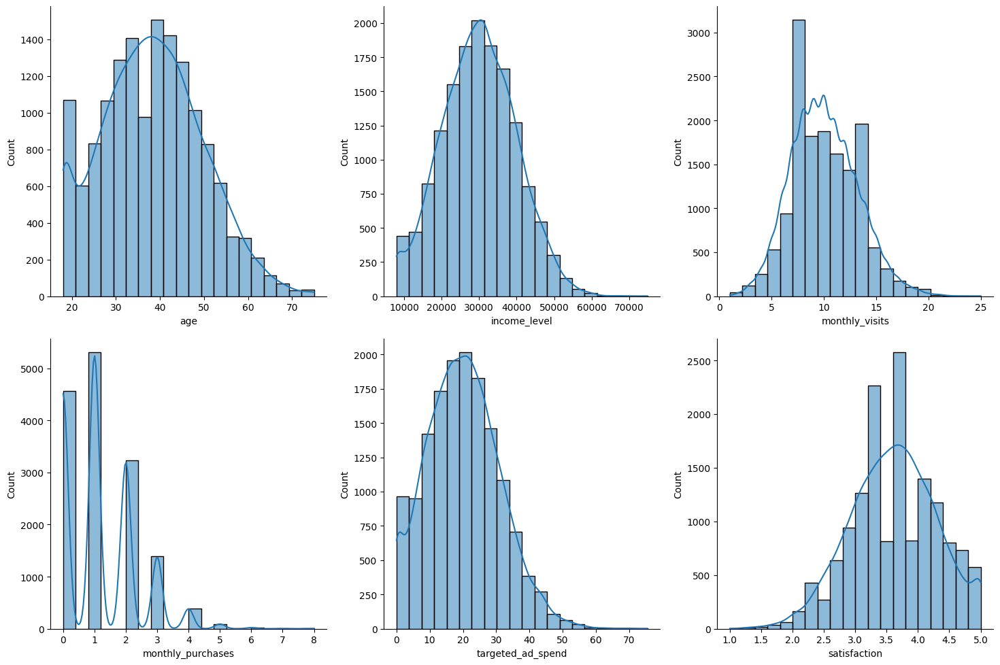
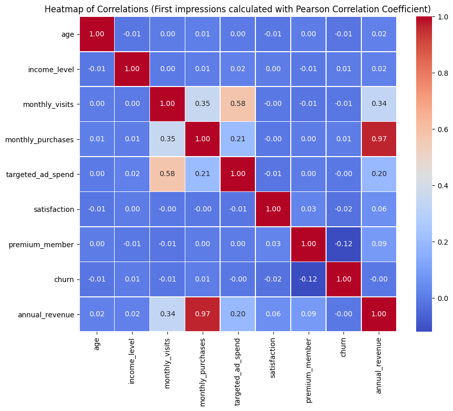
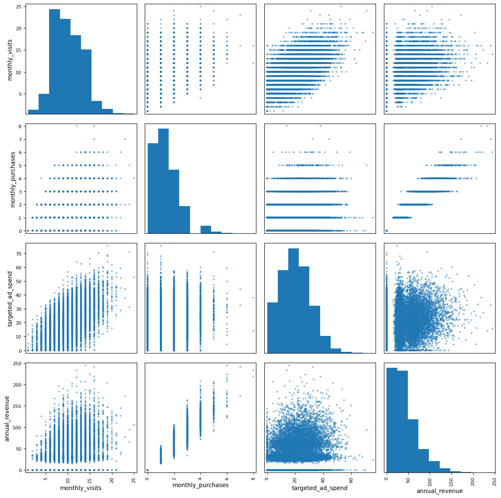
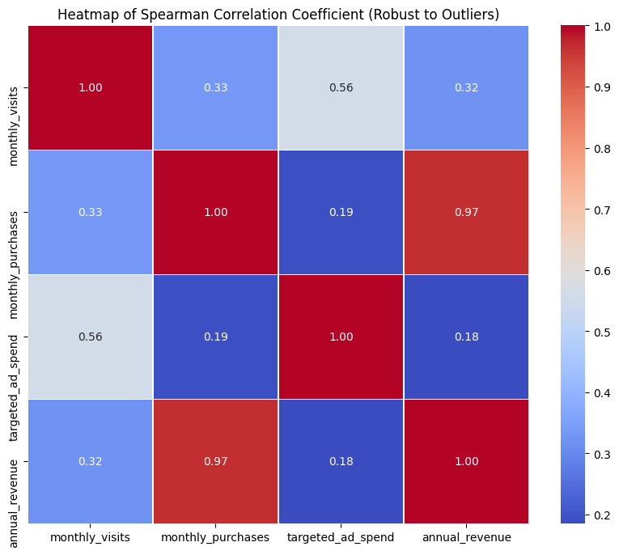
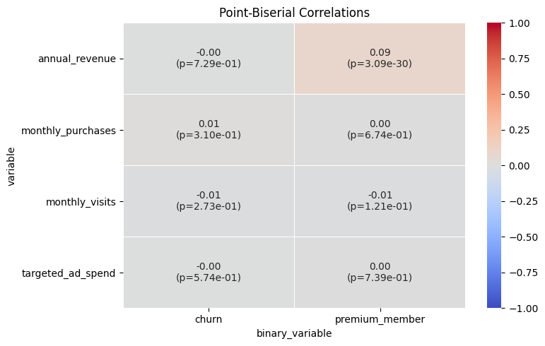
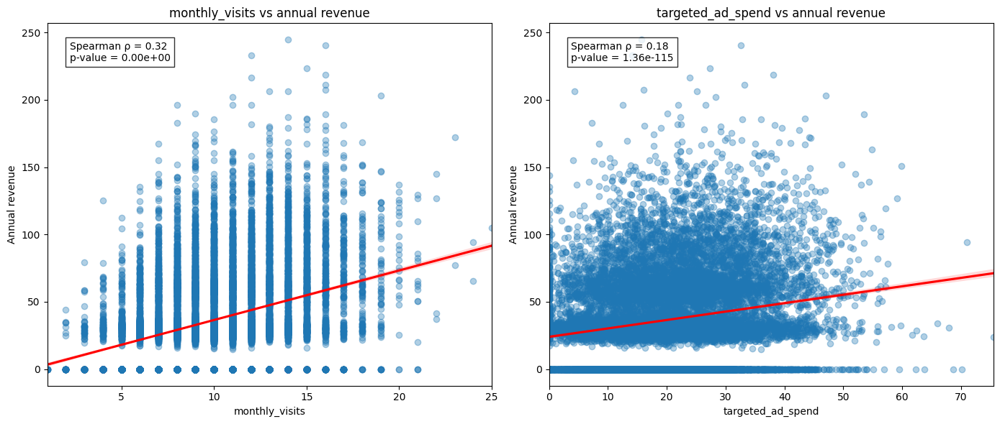

# NovaRetail+ — Behavioral Factors Associated with Annual Revenue

    

## 🔍 Overview

Correlational analysis of 15,000 customers of a Latin American e-commerce platform, built to identify which behavioral factors are most strongly associated with the annual revenue each customer generates. The work applies the correlation coefficient appropriate to each variable type — Pearson, Spearman, point-biserial and Cramér's V — and explicitly compares Pearson against Spearman to quantify how much outliers and non-linearity distort the picture. Purchase frequency emerged as the dominant behavioral signal (ρ = 0.97), visit frequency and targeted ad spend as secondary ones (ρ = 0.32 and ρ = 0.19), and premium membership was ruled out as a revenue lever despite a highly significant p-value (r = 0.09, p ≈ 3e-30) — a textbook separation of statistical significance from practical relevance.

## 🎯 Problem Statement

**Business Question:** Which customer behavior factors are most strongly associated with the annual revenue generated?

The Growth and Retention team needed to know, ahead of the 2024 close, where to concentrate retention and monetization effort: is the lever purchase frequency, engagement volume, advertising intensity, or premium subscription? A secondary question was whether region determines the device customers use, which would justify channel-specific campaign design.

> ⚠️ This is a **correlational (exploratory)** analysis. **Correlation ≠ causation.** No finding below establishes a causal direction, and the limitations section states explicitly what cannot be claimed.

---

## 💡 What I Did

### Phase 1: Load & Structure Review

- Loaded a single table of 15,000 records × 12 columns; confirmed zero missing values across every column
- Renamed all twelve columns from Spanish to English to keep the analysis legible to an international stakeholder

### Phase 2: Variable Typing & Profiling

Classified the columns into the three families that determine which coefficient is valid:

| Type | Columns |
|------|---------|
| **Numerical** | `age`, `income_level`, `monthly_visits`, `monthly_purchases`, `targeted_ad_spend`, `satisfaction`, `annual_revenue` |
| **Binary** | `premium_member` (13.9% premium), `churn` (15.1% churned) |
| **Categorical** | `device_type` (mobile-dominant), `region` (evenly spread) |

Profiled each numerical variable with distributions + KDE, verified both binary columns contain only `{0, 1}`, and verified the cardinality of both categorical columns.



**Distribution diagnosis:** `age` and `income_level` are well-behaved; `monthly_visits`, `monthly_purchases` and `targeted_ad_spend` are right-skewed with long tails. That skew is the reason the analysis does not rely on Pearson alone.

### Phase 3: Documented Assumptions

- The analysis uses the **entire available dataset** (no sampling, no exclusion of outliers)
- Data are assumed correctly typed and free of recording errors
- Coefficient choice is driven by variable type: Pearson (linear, numeric–numeric), Spearman (monotonic, robust to outliers), point-biserial (numeric–binary), Cramér's V (categorical–categorical)
- **Central assumption:** the analysis identifies relationships between variables and segments; it does not test causality

### Phase 4: Visual Exploration of Relationships

Built a Pearson correlation heatmap across all nine numeric/binary variables to get first impressions, then narrowed to the four key variables and inspected them pairwise with a scatter matrix.





A general scatterplot across all variables was deliberately skipped: visually saturated and less aligned with the business question than a focused selection.

### Phase 5: Numerical Evidence by Coefficient

1. **Spearman** on the four key numeric variables — the primary coefficient, chosen because every key variable carries outliers
2. **Pearson vs Spearman comparison** — all six unique pairs computed under both methods and differenced, to measure the actual impact of outliers rather than assume it
3. **Point-biserial** — four numeric variables × two binary variables, with p-values, rendered as an annotated heatmap
4. **Cramér's V** — `device_type` × `region`, via a contingency table and χ² statistic





---

## 🛠️ Technologies Used

| Category | Tools |
|----------|-------|
| **Python** | pandas, numpy |
| **Statistics** | `scipy.stats` — `spearmanr`, `pointbiserialr`, `chi2_contingency`; Cramér's V computed from χ² |
| **Visualization** | seaborn (`displot`, `countplot`, `heatmap`, `regplot`), matplotlib, `pandas.plotting.scatter_matrix` |
| **Techniques** | Variable typing, distribution profiling, coefficient selection by variable type, Pearson–Spearman robustness comparison, significance vs effect-size reasoning, non-causal interpretation |
| **Environment** | Jupyter Notebook |

---

## 📊 Key Findings

### Pearson vs Spearman — all key pairs

| Pair | Pearson (r) | Spearman (ρ) | Difference |
|------|-------------|--------------|------------|
| monthly_purchases ↔ annual_revenue | 0.967 | **0.968** | +0.000 |
| monthly_visits ↔ targeted_ad_spend | 0.579 | 0.559 | −0.020 |
| monthly_visits ↔ monthly_purchases | 0.354 | 0.333 | −0.021 |
| monthly_visits ↔ annual_revenue | 0.337 | **0.321** | −0.016 |
| monthly_purchases ↔ targeted_ad_spend | 0.208 | 0.193 | −0.015 |
| targeted_ad_spend ↔ annual_revenue | 0.198 | **0.185** | −0.013 |

Pearson overstates every relationship except the strongest one, but only by ~0.01–0.02 — the skew is real yet its distorting effect is modest. Spearman is reported as the primary coefficient throughout.

### Point-biserial — binary variables vs behavior

| Numeric variable | Binary variable | r | p-value |
|---|---|---|---|
| annual_revenue | premium_member | **0.093** | 3.1e-30 |
| monthly_visits | premium_member | −0.013 | 0.121 |
| monthly_purchases | premium_member | 0.003 | 0.674 |
| targeted_ad_spend | premium_member | 0.003 | 0.739 |
| annual_revenue | churn | −0.003 | 0.729 |
| monthly_visits | churn | −0.009 | 0.273 |
| monthly_purchases | churn | 0.008 | 0.310 |
| targeted_ad_spend | churn | −0.005 | 0.574 |

### Cramér's V

`device_type` × `region` = **0.0124** (p = 0.596) — effectively no association.

### Context → Findings → Implications (C→F→I)

**📍 Context:** NovaRetail+ closed 2024 with 15,000 profiled customers, 13.9% of them on a premium subscription and 15.1% already churned, and needed to decide where the Growth and Retention team should concentrate effort for the next cycle.

**🔍 Findings:**

1. **Purchase frequency dominates (ρ = 0.97).** The strongest association in the dataset by a wide margin — and strong enough to raise a construction-overlap concern between `monthly_purchases` and `annual_revenue`, flagged for validation rather than assumed away
2. **Engagement and ad spend are secondary (ρ = 0.32 and ρ = 0.19).** Positive but dispersed; higher values accompany higher revenue without a tight linear relationship
3. **Visits and ad spend move together (ρ = 0.56)** more strongly than either moves with revenue — advertising is associated with traffic far more than with money
4. **Premium membership is significant but negligible (r = 0.09, p ≈ 3e-30).** With n = 15,000 a trivial effect clears any significance threshold; the effect size, not the p-value, is the decision-relevant quantity
5. **Churn shows no behavioral signature at all** — every coefficient is within ±0.01 and none is significant
6. **Region does not determine device** (V = 0.012, p = 0.60) — no basis for region-specific channel strategy

**💡 Implications:**

- ✅ **Optimize for conversion, not traffic.** The lever most associated with revenue is how often customers buy, so retention effort belongs on converting existing visits into purchases
- 🔄 **Evaluate ad spend on conversion, not volume.** Advertising tracks visits (ρ = 0.56) more than revenue (ρ = 0.19); judge campaigns by conversion-based return, not spend or traffic
- ⚠️ **Do not treat premium status as a growth lever.** An r of 0.09 cannot carry an upselling strategy, however small its p-value. Premium may still matter for retention — on different evidence
- 🔍 **Validate the purchases–revenue relationship before modeling.** A ρ of 0.97 is a collinearity and metric-construction red flag; review how both metrics are built before using them together in a predictive model
- 📊 **Churn needs different data.** No behavioral variable here explains it; churn analysis requires temporal or richer features
- 🎯 **Drop region-by-device channel plans.** Nothing in the data supports them

### Secondary drivers, with regression lines



---

## 🚀 How to Use

This repository is **fully reproducible**: the raw dataset is committed alongside the notebook.

```
novaretail-revenue-correlation-analysis/
├── NovaRetail_Revenue_Correlation_Analysis.ipynb
├── novaretail_comportamiento_clientes_2024.csv
├── assets/
├── LICENSE
└── README.md
```

1. **Read without running** — every cell in the notebook retains its executed output, so the full analysis is readable as-is on GitHub
2. **Run it yourself** — clone the repository and launch the notebook from its root; the `read_csv` call uses a relative path, so no configuration is needed:

   ```bash
   git clone https://github.com/maxsantana-data2strategy/novaretail-revenue-correlation-analysis.git
   cd novaretail-revenue-correlation-analysis
   pip install pandas numpy scipy seaborn matplotlib jupyter
   jupyter notebook NovaRetail_Revenue_Correlation_Analysis.ipynb
   ```

3. **Reuse the figures** — all plots are exported individually to `assets/` for reports and presentations
4. **Point it at other data** — the analysis runs against any table carrying the twelve columns below; the notebook renames them from Spanish to English in its first cleaning step

### Dataset schema

| Column | Description |
|---|---|
| `customer_id` | Unique customer identifier |
| `age` | Customer age |
| `income_level` | Estimated annual income |
| `monthly_visits` | Visits to the app or website during the month |
| `monthly_purchases` | Purchases made in the month |
| `targeted_ad_spend` | Advertising spend assigned to the user |
| `satisfaction` | Satisfaction rating, 1–5 |
| `premium_member` | Premium subscription (1) or not (0) |
| `churn` | Churned (1) or not (0) |
| `device_type` | mobile / desktop / tablet |
| `region` | Customer region |
| `annual_revenue` | Annual revenue generated by the customer |

---

## ⚖️ Limitations

- **Correlation does not imply causation.** The findings identify associations; they do not license causal claims in either direction
- **Exploratory and cross-sectional.** No temporal ordering is established — whether a behavior precedes or follows revenue is unknown
- **Possible metric redundancy.** `monthly_purchases` and `annual_revenue` may measure overlapping aspects of customer value; the ρ = 0.97 must be validated before predictive modeling
- **Effect size over significance.** At n = 15,000, significance is cheap; associations such as premium membership are significant yet too small to act on
- **Limited categorical depth.** Only `device_type` and `region` were available, so other relevant segmentations remain unexplored

## 🧭 Next Steps

1. **Segment and compare** — split by `premium_member`, `churn` and activity level to detect behavioral differences; compare active vs inactive customers on revenue and retention; test whether `targeted_ad_spend` behaves differently by customer type or region
2. **Validate construction** — rule out collinearity and metric duplication between `monthly_purchases` and `annual_revenue` before any modeling
3. **Model and quantify** — run a regression to measure each variable's relative contribution to `annual_revenue`, assess ad efficiency with conversion and return metrics by segment, and profile high-value customers for targeted retention and upselling

---

## 📚 Learnings & Best Practices

- **Match the coefficient to the variable type.** Pearson on a skewed variable, or on a binary one, produces a number that looks valid and is not. Spearman, point-biserial and Cramér's V each exist for a reason
- **Compare methods instead of assuming the difference.** Running Pearson and Spearman side by side and differencing them turned "the data are skewed, so this matters" into a measured 0.01–0.02 — evidence rather than intuition
- **Significance and relevance are different questions.** The premium-membership result (p ≈ 3e-30, r = 0.09) is the clearest lesson in the project: a very small p-value with a very small effect size is a reason not to act
- **A correlation that is too strong is a warning, not a win.** ρ = 0.97 between a behavior and a revenue metric points at how the metrics were built before it points at a business insight
- **State what cannot be claimed.** Writing the non-claims explicitly next to each finding is what keeps a correlational analysis usable by decision-makers instead of misread by them

---

**Author:** Max Santana — Data Analyst, Business Intelligence & Strategic Foresight · [GitHub](https://github.com/maxsantana-data2strategy) · [Portfolio](https://maxsantana-data2strategy.github.io)

**Status:** ✅ Complete | **Data Quality:** ✅ Validated (zero nulls, no sentinels detected) | **Ready for Decisions:** ✅ Yes, with stated non-causal caveats
